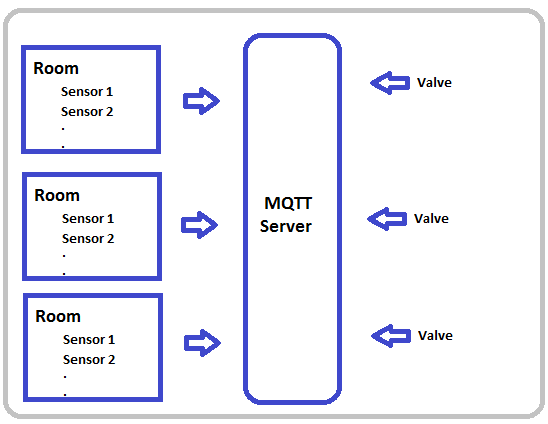

Simple MQTT  
=== 

## Problem I'm trying to solve 

There is a building, where each room has got a bunch of multiple heat sensors, and a valve to control temperature. Now goal is to maintain constant temperature in each room.




## Sensor Pulication 
All sensors publish their temperature readings in 'roomID/readings/temperature'  topic
These sensors need to be simulated for following use cases 

1. Each will be sumbitting the readings for same room, so there should not be much difference in their readings. 
2. Some times, sensor can go down, so if sometimes a sensor's readings are too varied then need to handle that case.  

## Valve Publication 

Valve for each room will publish its openness value to the topic '/actuators/roomID'. Valves for the room operates on two parameters 

1. historical average temperature 
2. acceleration of temperature. 

Rate at which valve opens is directly proportional to rise and fall of this acceleration parameter.   


# Usage 
```go
go run simpleMQTT.go
```
## Pseudo code
- init (config file) 
	- number of rooms
	- sesnsors in each room. 
- For every room
	- publishReadings() -- concurrently publishes readings every 1 minute
	- subscribeAndPublish() -- Concurrently get heat readings and publish heat value according to that
